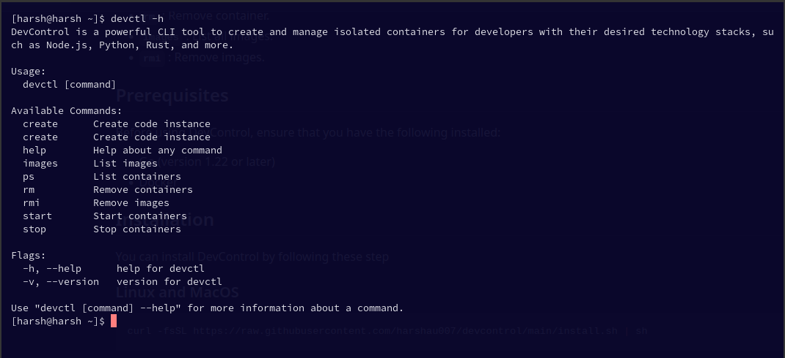

<!--  -->

# DevBox

DevBox is a powerful command-line interface tool built in Go using Cobra, Docker Engine API, and Bubbletea. It allows users to create and manage isolated containers with their desired technology stacks, such as Node.js, Python, Rust, and more.

## Features

- **`create`** : Create a new isolated container with your desired technology stack.
- **`start`** : Start an existing container.
- **`stop`** : Stop a running container.
- **`ps`** : List containers and their status.
- **`rm`** : Remove container.
- **`images`** : List all images.
- **`rmi`** : Remove images.

## Prerequisites

Before using DevBox, ensure that you have the following installed:

- Docker

## Installation

You can install DevBox by following these step

### Linux and MacOS

```sh
curl -fsSL https://raw.githubusercontent.com/harshau007/devbox/main/install.sh | sh
```

### &emsp; `OR`

Install via `makepkg`

- Run inside `pkgbuild/`

```bash
makepkg -si
```

## Uninstallation

You can uninstall DevBox by following these step

### Linux and MacOS

```sh
sudo rm -rf /usr/bin/devctl /usr/bin/portdevctl /usr/bin/startdevctl /usr/local/share/devbox/
```

## Usage

After installing DevBox, you can use the following commands:

> **TIP:** Initial images creation may take some time depending on your internet speed.

> **Demo video**:
> [](https://youtu.be/HBUJdv5mNqM?si=tfzS1vaJAhAlqzKA)

### `create`

```
devctl create [OPTIONS]
```

Creates a new isolated container with the specified technology stack. Available technologies include `nodejs`, `python`, `rust`, and more.

#### Options

- `--name, -n` (string): Specify a name for the container.
- `--volume, -v` (string): Specify the volume to mount.
- `--package, -p` (string): Specify the technology to use.
- `--port, -P` (string): Port to expose.
- `--url, -u` (string): Specify the URL to clone the repository.
- `--template, -t` (string): Create dev env using template.

> **Note:** If you specify the `--url` option, DevBox will clone the repository and use the cloned repository as the volume. Default directory is `Desktop`

> **Note:** If you specify the `--url` option, DevBox will take some time to setup the environment

### `start`

```
devctl start [OPTIONS]
```

Starts the specified container.

#### Options

- `--name, -n` (string): Specify a name for the container.

### `stop`

```
devctl stop [OPTIONS]
```

Stops the specified running container.

#### Options

- `--name, -n` (string): Specify a name for the container.

### `ps`

```
devctl ps [OPTIONS]
```

Lists running containers and their status.

- `--all, -a` : List all containers

### `rm`

```
devctl rm [OPTIONS] CONTAINER [CONTAINER...]
```

Remove images.

- `--force, -f` : Force remove containers.

### `images`

```
devctl images
```

Lists all images.

### `rmi`

```
devctl rmi [OPTIONS] IMAGE [IMAGE...]
```

Remove images.

- `--force, -f` : Force remove images.

## Contributing

Contributions to DevBox are welcome! If you find any issues or have suggestions for improvements, please open an issue or submit a pull request.

## License

DevBox is released under the [GNU General Public License](LICENSE).

## Acknowledgments

- [Cobra](https://github.com/spf13/cobra) for the CLI framework.
- [Docker Engine API](https://docs.docker.com/engine/api/) for interacting with Docker.
- [Bubbletea](https://github.com/charmbracelet/bubbletea) for the terminal user interface.
